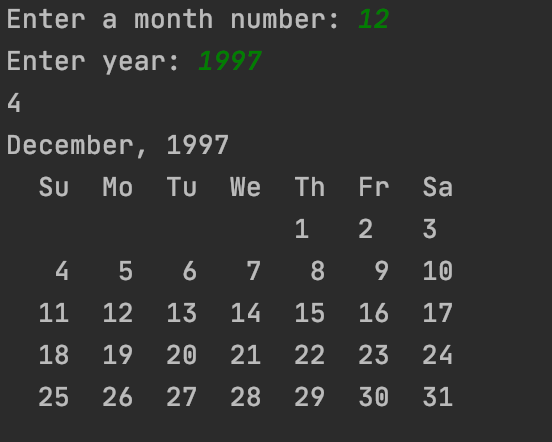

# Calendar Program #

## Description: ##
This program is for creating calendars by month for any year after 1753 (the year the calendar was standardized). It is to help you plan out your month/year. This progam is straightforward when it is running. Simply put in the month number and the year. Error checking is done on the user's input. Once the month and year has been entered the calendar for that month and year will be displayed.

## Development Environment: ##
This program was written in Java. To compile and use this program, first you must to download the Java JDK, either the [commercial](https://www.oracle.com/java/technologies/javase-downloads.html) or the [open source](https://jdk.java.net/) versions.

After one of those JDK versions is downloaded, download and IDE like [IntelliJ](https://www.jetbrains.com/idea/) to compile and run the program.

## How to Build/Execute the program: ##
After downloading [IntelliJ](https://www.jetbrains.com/idea/), open the folder containing the files of the program. Once the project opens, you should be able to run and compile the program by pressing the green play button in the top right corner of the window.

## Screenshots: ##

## Useful Websites: ##
* [W3 Schools Java](https://www.w3schools.com/java/)
* [Learn Java in 14 minutes](https://www.youtube.com/watch?v=RRubcjpTkks&t=559s)
* [For Loops Java](https://www.w3schools.com/java/java_for_loop.asp)